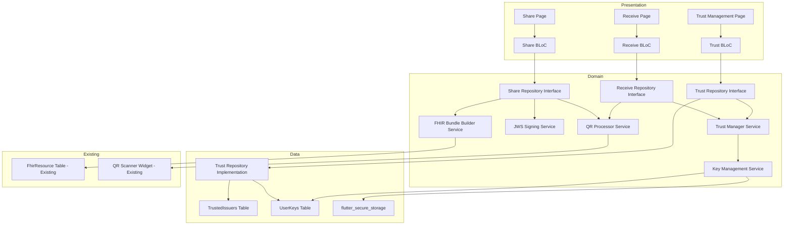

# System Patterns - SMART Health Share Foundation

## System Architecture

This document outlines the architectural patterns and key technical decisions for the SMART Health Cards/Links foundation in HealthWallet.me.

### High-Level Architecture

SMART Health Share follows the existing clean architecture pattern used throughout HealthWallet.me:



### Database Schema

#### New Tables

**1. UserKeys Table**
```dart
class UserKeys extends Table {
  IntColumn get id => integer().autoIncrement()();
  TextColumn get publicKey => text()(); // Base64 encoded ES256 public key (ECDSA P-256)
  DateTimeColumn get createdAt => dateTime().withDefault(currentDateAndTime)();
  
  @override
  Set<Column> get primaryKey => {id};
}
```
- **Purpose**: Store wallet's public key for identity
- **Cardinality**: Single row (one key pair per wallet)
- **Indexes**: None needed (single row)

**2. TrustedIssuers Table**
```dart
class TrustedIssuers extends Table {
  TextColumn get issuerId => text()(); // Unique identifier (hash, URL, or provided ID)
  TextColumn get name => text()(); // Human-readable name (e.g., "Kaiser Permanente")
  TextColumn get publicKeyJwk => text()(); // JWK (JSON Web Key) format
  TextColumn get source => text()(); // How it was added: "qr", "jwks", "manual"
  DateTimeColumn get addedAt => dateTime().withDefault(currentDateAndTime)();
  
  @override
  Set<Column> get primaryKey => {issuerId};
}
```
- **Purpose**: Store trusted issuer public keys for signature verification
- **Cardinality**: Multiple rows (one per trusted issuer)
- **Indexes**: On `issuerId` (primary key)

#### Existing Tables (Reused)

**FhirResource Table** (Existing)
- Stores FHIR resources as JSON in `resourceRaw` column
- Used for both existing resources and newly imported ones
- No schema changes needed

**Sources Table** (Existing)
- Tracks data sources
- Used to associate imported resources with sources
- No schema changes needed

### Database Migration

**Migration Strategy**: Add migration from version 6 to 7

```dart
@override
int get schemaVersion => 7;

onUpgrade: stepByStep(
  // ... existing migrations ...
  from6To7: (m, schema) async {
    await m.createTable(schema.userKeys);
    await m.createTable(schema.trustedIssuers);
  },
),
```

### Service Layer Architecture

#### Key Management Service
- **Location**: `lib/features/smart_health_share/domain/services/key_management_service.dart`
- **Responsibilities**:
  - Generate ES256 key pairs (ECDSA P-256)
  - Store private key in `flutter_secure_storage`
  - Store public key in Drift `UserKeys` table
  - Retrieve keys for signing operations
- **Dependencies**: `flutter_secure_storage`, `AppDatabase`

#### JWS Signing Service
- **Location**: `lib/features/smart_health_share/domain/services/jws_signing_service.dart`
- **Responsibilities**:
  - Create JWT structure with FHIR bundle payload
  - Sign JWT using ES256 private key (ECDSA P-256)
  - Verify JWT signatures using public keys
  - Handle JWS header and payload encoding
  - Ensure header includes required fields: `alg: ES256`, `typ: JWT`, `zip: DEF`, `kid`
- **Dependencies**: `KeyManagementService`, crypto library

#### FHIR Bundle Builder Service
- **Location**: `lib/features/smart_health_share/domain/services/fhir_bundle_builder.dart`
- **Responsibilities**:
  - Build FHIR Bundle from selected resources
  - Filter resources by type, date, source
  - Include patient resource and metadata
  - Resolve references between resources
- **Dependencies**: `FhirResourceDatasource`, `fhir_r4` package

#### QR Processor Service
- **Location**: `lib/features/smart_health_share/domain/services/qr_processor_service.dart`
- **Responsibilities**:
  - Parse SHC payloads (base64url, decompression)
  - Parse SHLink URLs
  - Extract FHIR bundles from QR data
- **Dependencies**: None (pure parsing logic)

#### Trust Manager Service
- **Location**: `lib/features/smart_health_share/domain/services/trust_manager_service.dart`
- **Responsibilities**:
  - Add trusted issuer (public key + metadata)
  - Remove trusted issuer
  - Verify incoming SHC signatures against trusted issuers
- **Dependencies**: `TrustRepository`, `JWSSigningService`

### Critical Implementation Paths

#### 1. Key Generation on First Use
- Check if keys exist in `UserKeys` table
- If not, generate ES256 key pair (ECDSA P-256)
- Store private key in `flutter_secure_storage`
- Store public key in `UserKeys` table
- Return public key for display/export

#### 2. Share Flow Execution
- User selects resources (via SharePage)
- Build FHIR Bundle (FHIRBundleBuilderService)
- Sign bundle (JWSSigningService + KeyManagementService)
- Encode as SMART Health Card (QRProcessorService)
- Generate QR code (QR Code Display Widget)

#### 3. Receive Flow Execution
- Scan QR code (QRScannerWidget)
- Parse payload (QRProcessorService)
- Extract issuer ID from JWT header
- Verify signature (TrustManagerService + JWSSigningService)
- If verified, import to FhirResource table

#### 4. Trust Management
- User adds issuer manually or via JWKS URL
- Store issuer public key in TrustedIssuers table
- Use for signature verification in receive flow
- Display in trust management UI

### Design Patterns in Use

1. **Repository Pattern**: Abstract repositories in domain, implementations in data layer
2. **Service Layer Pattern**: Domain services encapsulate business logic
3. **BLoC Pattern**: State management using flutter_bloc
4. **Dependency Injection**: Using `get_it` and `injectable`
5. **Table-Driven Design**: Drift tables define data structure
6. **Strategy Pattern**: Different processors for SHC vs. SHLink

### Integration Points

1. **Existing QR Scanner**: Extend `QRScannerWidget` to detect SMART Health Cards
2. **Existing Database**: Add new tables to `AppDatabase`, reuse `FhirResource` table
3. **Existing Navigation**: Add routes to `app_router.dart`
4. **Existing Records**: Use `FhirResourceDatasource` for resource selection
5. **Existing Sources**: Use `Sources` table for source tracking
